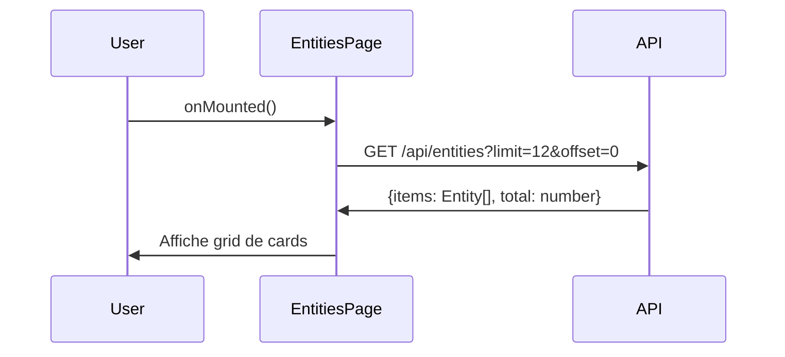
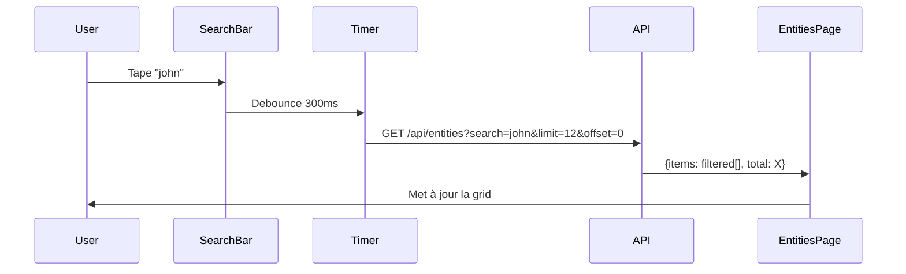
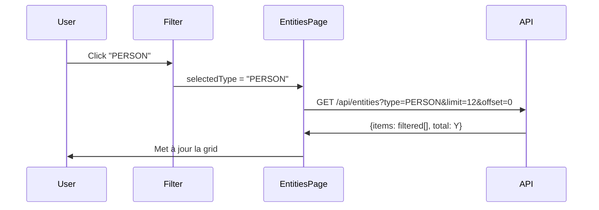
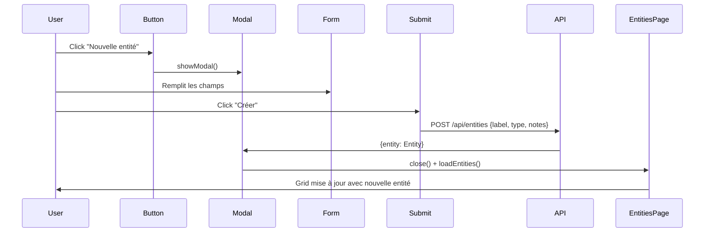
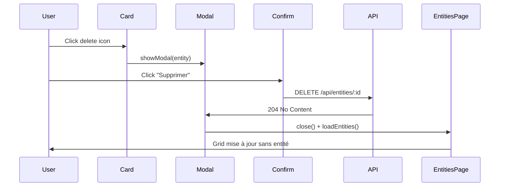

# Gestion des Entités - Fonctionnalité Complète

**Date**: 2025-01-XX  
**Statut**: ✅ Implémentation complète  
**Type**: Nouvelle fonctionnalité

## 📋 Vue d'ensemble

Cette fonctionnalité permet de gérer et rechercher toutes les entités encodées dans les rapports OSINT. Les utilisateurs peuvent consulter, créer, modifier et supprimer des entités, le tout avec une interface moderne utilisant le système de design glassmorphisme établi.

## 🎯 Objectifs

L'utilisateur a demandé :
> "crées un panel et menu entité qui me permet d'accéder à toute les entités encodés dans les différents rapport mais également y effectuer des recherches, elles doivent être classé par catégorie et facilement consultable"

### Fonctionnalités implémentées

1. ✅ **Accès aux entités** : Page dédiée listant toutes les entités
2. ✅ **Recherche** : Barre de recherche avec debounce (300ms)
3. ✅ **Catégorisation** : Filtres par 7 types d'entités
4. ✅ **Consultation facile** : Cards avec détails et modals
5. ✅ **CRUD complet** : Création, lecture, modification, suppression
6. ✅ **Design cohérent** : Glassmorphisme avec couleur secondaire du thème

## 🏗️ Architecture

### 1. Backend (déjà existant)

**Fichier**: `backend/src/modules/reports/entity.router.ts`

**Endpoints**:
```typescript
POST   /api/entities              // Créer une entité (REPORTS_WRITE)
GET    /api/entities              // Lister avec filtres (type, search, limit, offset)
GET    /api/entities/search       // Recherche autocomplete
GET    /api/entities/:entityId    // Détails d'une entité
PATCH  /api/entities/:entityId    // Modifier (REPORTS_WRITE)
DELETE /api/entities/:entityId    // Supprimer (REPORTS_WRITE)
```

**Permissions**:
- Lecture : `REPORTS_READ`
- Écriture : `REPORTS_WRITE`

### 2. Service API (déjà existant)

**Fichier**: `frontend/src/services/api/entities.ts`

**Types d'entités**:
```typescript
type EntityType =
  | "PERSON"        // Personne
  | "ORGANIZATION"  // Organisation
  | "TELEPHONE"     // Numéro de téléphone
  | "EMAIL"         // Adresse email
  | "ACCOUNT"       // Compte utilisateur
  | "ADDRESS"       // Adresse physique
  | "OTHER"         // Autre
```

**Interface Entity**:
```typescript
interface Entity {
  id: string;
  label: string;              // Nom de l'entité
  type: EntityType;
  notes?: string;             // Notes optionnelles
  createdAt: string;
  updatedAt: string;
  _count?: {
    modules: number;          // Nombre de modules liés
    researchRecords: number;  // Nombre de recherches liées
  };
}
```

**Méthodes API**:
```typescript
entitiesApi.list({ type?, search?, limit?, offset? })
entitiesApi.search(query, type?, limit)
entitiesApi.getById(id)
entitiesApi.create({ label, type, notes? })
entitiesApi.update(id, { label?, type?, notes? })
entitiesApi.delete(id)
```

### 3. Page Frontend (nouveau)

**Fichier**: `frontend/src/pages/EntitiesPage.vue`

**Composants**:
- En-tête avec titre et bouton "Nouvelle entité"
- Barre de recherche avec icône
- Filtres par catégorie (8 boutons : Toutes + 7 types)
- Grille de cards responsive (1 col mobile, 2 cols tablet, 3 cols desktop)
- Pagination
- 3 modals : détails, création, suppression

**Design**:
```scss
// Glassmorphisme cohérent
bg-white/10 backdrop-blur-sm         // Fond de card
ring-1 ring-white/20                 // Bordure subtile
bg-white/25                          // État actif (filtres)
bg-white/15                          // État hover
shadow-lg, shadow-xl                 // Ombres

// Transitions
transition-all duration-200
hover:scale-105                      // Effet de zoom léger
```

**Icônes par type**:
```typescript
PERSON       → person
ORGANIZATION → business
TELEPHONE    → phone
EMAIL        → email
ACCOUNT      → account_circle
ADDRESS      → location_on
OTHER        → label
```

## 🔄 Routing

### Route ajoutée

**Fichier**: `frontend/src/router/index.ts`

```typescript
{
  path: "entities",
  name: "entities",
  component: EntitiesPage,
  meta: {
    requiresAuth: true,
    permissions: ["reports:read"],
  },
}
```

### Navigation ajoutée

**Fichier**: `frontend/src/pages/DashboardPage.vue`

```typescript
{
  label: "Entités",
  to: { name: "entities" },
  icon: "group_work",
  badge: undefined,
}
```

Position dans le menu : entre "Rapports" et "Recherche"

## 🎨 Interface Utilisateur

### 1. En-tête

```vue
<div class="flex justify-between">
  <div>
    <h1>Entités</h1>
    <p>Gérez et recherchez toutes les entités...</p>
  </div>
  <button>Nouvelle entité</button>
</div>
```

### 2. Recherche

- Barre de recherche avec icône `search`
- Debounce de 300ms pour éviter trop de requêtes
- Reset de la pagination à chaque recherche
- Placeholder : "Rechercher une entité..."

### 3. Filtres par catégorie

8 boutons avec badges optionnels :
- **Toutes** (count: total) - icon: `grid_view`
- **Personne** - icon: `person`
- **Organisation** - icon: `business`
- **Téléphone** - icon: `phone`
- **Email** - icon: `email`
- **Compte** - icon: `account_circle`
- **Adresse** - icon: `location_on`
- **Autre** - icon: `label`

États visuels :
- Actif : `bg-white/25 shadow-lg`
- Inactif : `bg-white/10 hover:bg-white/15`

### 4. Grid de cards

**Layout responsive**:
```css
grid-cols-1           /* Mobile */
md:grid-cols-2        /* Tablet */
lg:grid-cols-3        /* Desktop */
gap-4
```

**Card structure**:
```vue
<div class="entity-card">
  <!-- Header -->
  <div class="flex justify-between">
    <div>
      <icon />
      <badge>Type</badge>
    </div>
    <button>delete</button>
  </div>

  <!-- Content -->
  <h3>Label</h3>
  <p>Notes (2 lignes max)</p>

  <!-- Footer stats -->
  <div class="stats">
    <span>X modules</span>
    <span>X recherches</span>
  </div>
</div>
```

**Effets**:
- Hover : `hover:bg-white/15 hover:shadow-xl hover:scale-105`
- Cursor : `cursor-pointer`
- Transition : `transition-all duration-200`

### 5. États

**Loading** (6 skeleton cards) :
```vue
<div class="animate-pulse rounded-xl bg-white/10 h-40"></div>
```

**Empty state** :
```vue
<div class="text-center">
  <icon>folder_off</icon>
  <p>Aucune entité trouvée</p>
  <p>Message contextuel selon recherche ou non</p>
</div>
```

### 6. Pagination

Affichée si `total > limit` (12 par défaut)

```vue
<div class="pagination">
  <button chevron_left :disabled="offset === 0" />
  <span>Page X sur Y</span>
  <button chevron_right :disabled="offset + limit >= total" />
</div>
```

### 7. Modals

#### Modal Détails

```vue
<dialog class="modal-box bg-white/10 backdrop-blur-xl">
  <h3>Détails de l'entité</h3>
  
  <div>Type avec icône + badge</div>
  <div>Nom (label)</div>
  <div>Notes (si présentes)</div>
  <div class="grid-cols-2">
    <div>Modules: X</div>
    <div>Recherches: X</div>
  </div>
  <div class="grid-cols-2">
    <div>Créée le: date</div>
    <div>Modifiée le: date</div>
  </div>
</dialog>
```

#### Modal Création

```vue
<dialog>
  <h3>Nouvelle entité</h3>
  
  <select>Type</select>
  <input>Nom</input>
  <textarea>Notes (optionnel)</textarea>
  
  <div class="modal-action">
    <button>Annuler</button>
    <button :disabled="!valid || creating">
      Créer
    </button>
  </div>
</dialog>
```

#### Modal Suppression

```vue
<dialog>
  <h3>Supprimer l'entité</h3>
  
  <p>Êtes-vous sûr de vouloir supprimer <strong>label</strong> ?</p>
  <p>Cette action est irréversible.</p>
  
  <div class="modal-action">
    <button>Annuler</button>
    <button :disabled="deleting" class="btn-error">
      Supprimer
    </button>
  </div>
</dialog>
```

## 🔐 Permissions

### Lecture (REPORTS_READ)

- Accéder à la page `/entities`
- Voir la liste des entités
- Rechercher
- Filtrer par catégorie
- Voir les détails

### Écriture (REPORTS_WRITE)

- Bouton "Nouvelle entité" affiché
- Créer une entité
- Modifier une entité
- Bouton "delete" affiché sur les cards
- Supprimer une entité

**Code de vérification** :
```typescript
const { hasPermission } = useAuth();
const canWrite = computed(() => hasPermission("REPORTS_WRITE"));
```

## 📊 Flux de données

### Chargement initial



### Recherche



### Filtrage par type



### Création



### Suppression



## 🧪 Tests à effectuer

### Tests fonctionnels

- [ ] Accès à la page `/entities` depuis le menu
- [ ] Liste des entités s'affiche correctement
- [ ] Recherche fonctionne avec debounce
- [ ] Filtres par catégorie (8 types)
- [ ] Pagination (précédent/suivant)
- [ ] Modal détails avec toutes les infos
- [ ] Création d'entité (si REPORTS_WRITE)
- [ ] Suppression d'entité (si REPORTS_WRITE)
- [ ] État vide affiché si aucune entité
- [ ] Loading state pendant les requêtes

### Tests de permissions

- [ ] Utilisateur avec REPORTS_READ :
  - Peut voir la liste
  - Peut rechercher/filtrer
  - Peut voir les détails
  - **NE peut PAS** voir le bouton "Nouvelle entité"
  - **NE peut PAS** voir les boutons delete

- [ ] Utilisateur avec REPORTS_WRITE :
  - Peut tout faire ci-dessus
  - Peut créer des entités
  - Peut supprimer des entités

### Tests responsive

- [ ] Mobile (1 colonne)
- [ ] Tablet (2 colonnes)
- [ ] Desktop (3 colonnes)
- [ ] Modals adaptées aux petits écrans

### Tests UI/UX

- [ ] Glassmorphisme cohérent avec le reste de l'app
- [ ] Couleur secondaire du thème utilisée
- [ ] Transitions smooth (200ms)
- [ ] Hover effects sur les cards
- [ ] Icons Material correctes
- [ ] Loading spinners pendant les actions

## 📁 Fichiers modifiés/créés

### Créé
- ✅ `frontend/src/pages/EntitiesPage.vue` (460 lignes)

### Modifié
- ✅ `frontend/src/router/index.ts` (ajout route + import)
- ✅ `frontend/src/pages/DashboardPage.vue` (ajout menu)

### Existant (non modifié)
- ✅ `backend/src/modules/reports/entity.router.ts`
- ✅ `frontend/src/services/api/entities.ts`

## 🎨 Cohérence du Design System

La page respecte le design system glassmorphisme établi :

### Couleurs
- Background : `bg-white/10` (10% opacity)
- Hover : `bg-white/15` (15% opacity)
- Active : `bg-white/25` (25% opacity)
- Bordures : `ring-1 ring-white/20`
- Texte : `text-white`, `text-white/70`, `text-white/50`

### Effets
- Blur : `backdrop-blur-sm`, `backdrop-blur-xl`
- Ombres : `shadow-lg`, `shadow-xl`
- Transitions : `transition-all duration-200`
- Scales : `hover:scale-105`

### Bordures
- Cards : `rounded-xl` (12px)
- Inputs : `rounded-xl`
- Buttons : `rounded-xl`
- Badges : `rounded-lg` (8px)

### Typographie
- H1 : `text-3xl font-bold text-white`
- H3 : `text-lg font-bold text-white`
- Body : `text-white/90`
- Labels : `text-white/70 text-sm`
- Stats : `text-white/50 text-xs`

## 🚀 Utilisation

### Accès
1. Se connecter à l'application
2. Cliquer sur "Entités" dans le menu latéral
3. La page affiche toutes les entités

### Recherche
1. Taper dans la barre de recherche
2. Les résultats se filtrent automatiquement (300ms debounce)
3. Combinable avec les filtres par catégorie

### Filtrage
1. Cliquer sur un type d'entité (ex: "Personne")
2. La liste se filtre instantanément
3. Cliquer sur "Toutes" pour réinitialiser

### Consultation
1. Cliquer sur une card d'entité
2. Le modal s'ouvre avec tous les détails
3. Fermer avec ✕ ou en cliquant en dehors

### Création (si permissions)
1. Cliquer sur "Nouvelle entité"
2. Sélectionner le type
3. Remplir le nom (requis)
4. Ajouter des notes (optionnel)
5. Cliquer sur "Créer"

### Suppression (si permissions)
1. Cliquer sur l'icône delete d'une card
2. Confirmer la suppression
3. L'entité est retirée de la liste

## 📝 Notes techniques

### Debounce de recherche
```typescript
let searchTimeout: NodeJS.Timeout;
const handleSearch = () => {
  clearTimeout(searchTimeout);
  searchTimeout = setTimeout(() => {
    offset.value = 0; // Reset pagination
    loadEntities();
  }, 300);
};
```

### Pagination
- Limite par défaut : 12 entités
- Offset incrémenté par `limit`
- Boutons désactivés aux extrémités
- Calcul automatique du nombre de pages

### Watchers
```typescript
watch(selectedType, () => {
  offset.value = 0; // Reset pagination
  loadEntities();
});
```

### Gestion des erreurs
Toutes les requêtes API sont dans des `try/catch` avec logs console.

### Line clamp
Les notes sont tronquées à 2 lignes avec `line-clamp-2` (TailwindCSS).

### Format de date
```typescript
new Date(dateString).toLocaleDateString("fr-FR", {
  day: "2-digit",
  month: "2-digit",
  year: "numeric",
  hour: "2-digit",
  minute: "2-digit",
});
```

## 🔮 Améliorations futures possibles

- [ ] Export CSV/Excel de la liste
- [ ] Import en masse d'entités
- [ ] Fusion de doublons
- [ ] Historique des modifications
- [ ] Liens vers les rapports associés
- [ ] Graphiques de répartition par type
- [ ] Tags/labels personnalisés
- [ ] Recherche avancée (regex, multi-critères)
- [ ] Tri personnalisé (alpha, date, usage)
- [ ] Vue en tableau (alternative à la grid)
- [ ] Raccourcis clavier
- [ ] Édition inline des entités

## ✅ Checklist de validation

- [x] Backend routes existantes vérifiées
- [x] Service API existant vérifié
- [x] Page EntitiesPage.vue créée
- [x] Route `/entities` ajoutée au router
- [x] Menu "Entités" ajouté à la navigation
- [x] Design glassmorphisme cohérent
- [x] Permissions REPORTS_READ/WRITE respectées
- [x] Recherche avec debounce
- [x] Filtres par catégorie (8 types)
- [x] CRUD complet (Create, Read, Delete)
- [x] Modals pour détails/création/suppression
- [x] Pagination fonctionnelle
- [x] États loading/empty
- [x] Responsive design (mobile/tablet/desktop)
- [x] Icons Material appropriées
- [x] Documentation complète

## 🎯 Conclusion

La fonctionnalité de gestion des entités est **complète et prête à l'emploi**. Elle répond exactement aux besoins de l'utilisateur :

1. ✅ **Accès facilité** : Menu dédié "Entités"
2. ✅ **Recherche efficace** : Barre de recherche + autocomplete
3. ✅ **Catégorisation claire** : 8 filtres visuels
4. ✅ **Consultation aisée** : Cards informatives + modals détaillés
5. ✅ **Design moderne** : Glassmorphisme cohérent avec le reste de l'app

L'utilisateur peut maintenant gérer toutes ses entités OSINT de manière professionnelle et intuitive.
