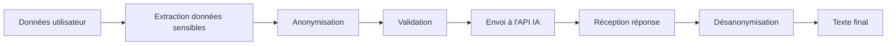

# Protection des Données Personnelles - Sanitization IA

## 🔒 Vue d'ensemble

Pour protéger la vie privée et respecter le RGPD, **aucune donnée personnelle** n'est transmise aux APIs IA (Gemini, OpenAI, Claude). 

Un système d'**anonymisation/désanonymisation** automatique a été implémenté.

## 🛡️ Principe de fonctionnement

### 1. Anonymisation (avant envoi à l'IA)

```
Données originales → Sanitization → Placeholders → Envoi à l'API IA
```

**Exemple** :
```
Texte original:
"Jean Dupont (jean.dupont@example.com, 06 12 34 56 78) habite à Paris."

Texte envoyé à l'IA:
"[PERSONNE_1] ([EMAIL_1], [TELEPHONE_1]) habite à [ADRESSE_1]."
```

### 2. Génération par l'IA

L'IA traite le texte avec les placeholders et génère du contenu.

### 3. Désanonymisation (après réception)

```
Réponse IA avec placeholders → Restauration → Données réelles
```

**Exemple** :
```
Réponse IA:
"[PERSONNE_1] est domicilié à [ADRESSE_1] et joignable au [TELEPHONE_1]."

Texte final:
"Jean Dupont est domicilié à Paris et joignable au 06 12 34 56 78."
```

## 📋 Types de données protégées

Le `DataSanitizerService` anonymise automatiquement :

| Type | Exemples | Placeholder |
|------|----------|-------------|
| **Noms et prénoms** | Jean Dupont, Marie Martin | `[PERSONNE_1]`, `[PERSONNE_2]` |
| **Emails** | jean@example.com | `[EMAIL_1]` |
| **Téléphones** | 06 12 34 56 78, 01.23.45.67.89 | `[TELEPHONE_1]` |
| **Dates de naissance** | 15/03/1985 | `[DATE_NAISSANCE_1]` |
| **Adresses** | 123 rue de la Paix, Paris | `[ADRESSE_1]` |
| **Identifiants** | SIREN, NIR, etc. | `[IDENTIFIANT_1]` |
| **Pseudonymes** | @username, pseudo123 | `[PSEUDO_1]` |
| **Adresses IP** | 192.168.1.1 | `[IP_1]` |

## 💻 Utilisation dans le code

### Backend - Service IA

```typescript
import { ReportGenerationContext } from './gemini.service';
import { PersonalData } from './data-sanitizer.service';

// Contexte avec données personnelles
const context: ReportGenerationContext = {
  reportTitle: 'Enquête sur Jean Dupont',
  existingContent: 'Contact: jean@example.com, Tel: 06 12 34 56 78',
  
  // Liste des données à anonymiser
  personalData: {
    names: ['Jean Dupont'],
    emails: ['jean@example.com'],
    phones: ['06 12 34 56 78'],
  }
};

// Le service IA anonymise automatiquement
const result = await GeminiService.generateReportSummary(context);
// ou
const result = await ClaudeService.generateReportSummary(context);

// result.content contient le texte avec les vraies données restaurées
```

### Détection automatique

Le service peut aussi détecter automatiquement certaines données :

```typescript
import { DataSanitizerService } from './data-sanitizer.service';

const text = 'Contact: jean@example.com, IP: 192.168.1.1';

// Détection automatique
const detected = DataSanitizerService.autoDetect(text);
// {
//   emails: ['jean@example.com'],
//   ipAddresses: ['192.168.1.1']
// }
```

## 🔍 Validation de la sanitization

Le service valide que le texte est bien anonymisé :

```typescript
const { isClean, foundData } = DataSanitizerService.validateSanitization(
  sanitizedText,
  personalData
);

if (!isClean) {
  console.warn('Données personnelles détectées:', foundData);
  // ['Nom: Jean Dupont', 'Email: jean@example.com']
}
```

## 📊 Workflow complet



### Détail du processus

1. **Extraction** : L'utilisateur ou le système fournit les données personnelles à protéger
2. **Anonymisation** : Remplacement par des placeholders uniques
3. **Validation** : Vérification qu'aucune donnée personnelle ne reste
4. **Envoi** : Transmission du texte anonymisé à l'API IA
5. **Génération** : L'IA génère du texte avec les placeholders
6. **Désanonymisation** : Remplacement des placeholders par les vraies données
7. **Résultat** : Texte final avec données réelles

## 🧪 Tests unitaires

Des tests complets garantissent le bon fonctionnement :

```bash
cd backend
npm test -- data-sanitizer.test.ts
```

**Tests couverts** :
- ✅ Anonymisation de chaque type de donnée
- ✅ Anonymisation de plusieurs types simultanément
- ✅ Désanonymisation correcte
- ✅ Détection automatique (emails, téléphones, IPs)
- ✅ Validation de la sanitization
- ✅ Cycle complet (anonymisation → désanonymisation)
- ✅ Objets imbriqués

## 📝 Exemple complet

### Avant (données sensibles)

```json
{
  "reportTitle": "Enquête sur Jean Dupont",
  "existingContent": "Suspect: Jean Dupont\nEmail: jean.dupont@example.com\nTéléphone: 06 12 34 56 78\nAdresse: 123 rue de la Paix, 75001 Paris",
  "personalData": {
    "names": ["Jean Dupont"],
    "emails": ["jean.dupont@example.com"],
    "phones": ["06 12 34 56 78"],
    "addresses": ["123 rue de la Paix, 75001 Paris"]
  }
}
```

### Pendant (envoyé à l'IA)

```
Titre: "Enquête sur [PERSONNE_1]"

Contenu: "Suspect: [PERSONNE_1]
Email: [EMAIL_1]
Téléphone: [TELEPHONE_1]
Adresse: [ADRESSE_1]"
```

### Après (résultat final)

```
"Dans le cadre de l'enquête concernant Jean Dupont, les investigations 
ont révélé que le suspect est joignable au 06 12 34 56 78 et par email 
à jean.dupont@example.com. Le domicile situé au 123 rue de la Paix, 
75001 Paris a fait l'objet d'une surveillance."
```

## ⚠️ Bonnes pratiques

### ✅ À FAIRE

1. **Toujours fournir `personalData`** dans le contexte de génération
2. **Lister TOUTES les données sensibles** (noms, emails, téléphones, etc.)
3. **Vérifier les logs** pour détecter les warnings de sanitization
4. **Utiliser autoDetect()** en complément pour détecter les données oubliées

### ❌ À ÉVITER

1. ❌ Ne pas oublier de données sensibles dans la liste
2. ❌ Ne pas désactiver la sanitization
3. ❌ Ne pas ignorer les warnings dans les logs
4. ❌ Ne pas transmettre d'identifiants techniques (ID base de données OK)

## 🔐 Conformité RGPD

Ce système garantit :

- ✅ **Minimisation des données** : Seules les données anonymisées sont envoyées
- ✅ **Pseudonymisation** : Remplacement par des placeholders
- ✅ **Limitation de la finalité** : Les données ne sont utilisées que pour la génération
- ✅ **Traçabilité** : Logs de chaque anonymisation
- ✅ **Sécurité** : Pas de transmission de données personnelles à des tiers

## 📚 API du DataSanitizerService

### Méthodes principales

```typescript
class DataSanitizerService {
  // Anonymise un texte
  static sanitizeText(text: string, personalData: PersonalData): 
    { sanitized: string; map: SanitizationMap }

  // Restaure les données
  static desanitizeText(text: string, map: SanitizationMap): string

  // Anonymise un objet de contexte
  static sanitizeContext(context: any, personalData: PersonalData): 
    { sanitized: any; map: SanitizationMap }

  // Détection automatique
  static autoDetect(text: string): PersonalData
  static detectEmails(text: string): string[]
  static detectPhones(text: string): string[]
  static detectIPs(text: string): string[]

  // Validation
  static validateSanitization(text: string, personalData: PersonalData): 
    { isClean: boolean; foundData: string[] }
}
```

### Interface PersonalData

```typescript
interface PersonalData {
  names?: string[];           // Noms et prénoms
  emails?: string[];          // Adresses email
  phones?: string[];          // Numéros de téléphone
  birthDates?: string[];      // Dates de naissance
  addresses?: string[];       // Adresses postales
  ids?: string[];            // Identifiants (SIREN, NIR, etc.)
  pseudonyms?: string[];     // Pseudos, usernames
  ipAddresses?: string[];    // Adresses IP
}
```

## 🚀 Prochaines améliorations

- [ ] Détection automatique des noms (NLP)
- [ ] Détection des dates de naissance (patterns)
- [ ] Support des adresses postales complètes
- [ ] Anonymisation des SIREN/SIRET
- [ ] Interface admin pour configurer les patterns
- [ ] Statistiques d'anonymisation

---

**Date de création** : 9 octobre 2025  
**Dernière mise à jour** : 9 octobre 2025  
**Statut** : ✅ Opérationnel
